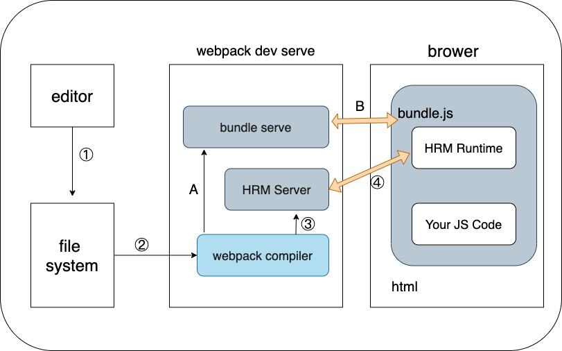

# 开发环境

要是每次文件发生变化，能自动执行构建命令并刷新页面，会给极大提高开发效率和体验，webpack 提供了相关配置。

## 文件监听

两种监听模式：

- webpack 命令 `--watch` 参数；
- 配置文件中设置 `watch` 为 `true`，命令中的配置优先级比配置文件的高，推荐使用。

```js
	// 只有开启监听模式时，watchOptions才有意义
	// 默认 false，也就是不开启
	watch: true,
	watchOptions: {
		// 不监听的文件或者文件夹，以缩小监听范围，支持正则匹配
		// 默认为空
		ignored: /node_modules/,
		// 监听到变化发生后会等300ms再去执行动作，防止文件更新太快
		// 默认为300ms
		aggregateTimeout: 300,
		// 判断文件是否发生变化是通过不停询问系统指定文件有没有变化实现的
		// 默认每秒问1000次
		poll: 1000,
	}
```

## 热更新

发现文件变化后，设置热更新后，会局部更新页面，免去手动刷新的麻烦，提高开发体验。

webpack 内置了一个服务器，叫`webpack-dev-server` 简称 `WDS`，用于服务编译后的文件，编译后的文件是放在内存中，读写速度快，可立刻看到页面变化。
热更新需要和 `HotModuleReplacementPlugin` 简称 `HMR` 插件一起使用，替换有变化的模块，达到局部刷新的效果。

```js
	devServer: {
    hot:true,
    contentBase: './build', //指定 WDS 的服务路径
  }
	plugins: [
		new webpack.HotModuleReplacementPlugin(),
  ]
```

> 开启 hot 就要调用该插件，否则会提示错误。

```bash
Uncaught Error: [HMR] Hot Module Replacement is disabled.
```

## 使用 webpack-dev-middleware 实现热更新

适合更加灵活的情况，但是报错了。不知道为何。

## 热更新原理



`webpack compile`：将 JS 编译成 Bundle

`bundle.js`：构建输出的文件。

`HMR Server`：将热更新的文件输出给 HMR Runtime

`Bundle server`：提供文件在浏览器中访问。

`HMR Runtime`：会被注入浏览器，文件变化时更新。

热更新过程：

启动阶段：① → ② → A → B

更新阶段：① → ② → ③ → ④

## 构建之前清除上次构建结果

```js
new CleanWebpackPlugin(),
```
